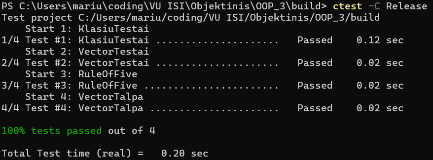
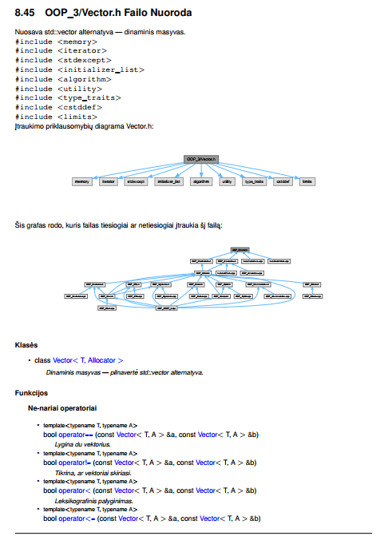
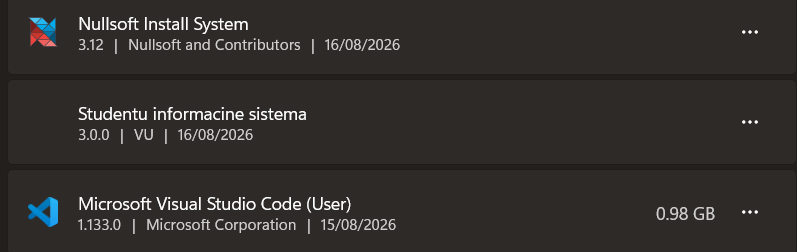

# Studentų Informacinė Sistema

**OOP_Marius_Augustinas** · VU ISI Objektinio programavimo kurso laboratoriniai darbai

C++ programa studentų duomenims įvesti, saugoti, apdoroti ir analizuoti. Versijoje v3.0 vietoje `std::vector` naudojamas **nuosavas `Vector` konteineris**, realizuojantis ~99% standartinio konteinerio interfeiso.

---

## Turinys

1. [Versijų istorija](#1-versijų-istorija)
2. [Vector konteineris](#2-vector-konteineris)
3. [Funkcijų pavyzdžiai](#3-funkcijų-pavyzdžiai)
4. [Spartos tyrimai](#4-spartos-tyrimai)
5. [Unit testai](#5-unit-testai)
6. [Dokumentacija](#6-dokumentacija)
7. [Diegimas](#7-diegimas)
8. [Naudojimosi instrukcija](#8-naudojimosi-instrukcija)
9. [Failų struktūra](#9-failų-struktūra)

---

## 1. Versijų istorija

| Versija | Pagrindiniai pakeitimai |
|---|---|
| **v0.1** | Pradinė realizacija — `std::vector`, rankinis įvedimas |
| **v0.2** | Failo skaitymas ir rašymas, rikiavimas |
| **v0.3** | Kodas suskaidytas į modulius, išimčių valdymas |
| **v0.4** | Studentų skirstymas į grupes, spartos testavimas |
| **v0.5** | `template<typename Container>` — `vector`/`list`/`deque` |
| **v1.0** | Trijų skirstymo strategijų palyginimas |
| **v1.1** | `struct` → `class`; I/O optimizacija |
| **v1.2** | Pilna **Rule of Five**, perdengti operatoriai |
| **v1.5** | **Abstrakti bazinė klasė `zmogus`** + išvestinė `studentas` |
| **v2.0** | Doxygen dokumentacija, Catch2 unit testai |
| **v3.0** | **Nuosavas `Vector` konteineris**, spartos analizė, `setup.exe` diegimo failas |

---

## 2. Vector konteineris

### Techninė aplinka

| Parametras | Reikšmė |
|---|---|
| Procesorius | Intel Core i7-8565U (4 branduoliai / 8 gijų, iki 4.6 GHz) |
| RAM | 8 GB DDR4 |
| Saugykla | 250 GB SSD |
| OS | Windows 11 |
| Kompiliatorius | MSVC (Visual Studio 2022), x64 Release, `/O2` |

### Architektūra

Klasė laiko tris rodykles, kaip ir tipinė `std::vector` realizacija:

```
begin_  →  pradžia
end_    →  po paskutinio elemento    (size = end_ - begin_)
cap_    →  po paskirtos atminties    (capacity = cap_ - begin_)
```

Atmintis **skiriama ir konstruojama atskirai**: `allocate()` tik rezervuoja baitus, o objektai kuriami `construct()` metodu. Todėl `reserve(1000)` nesukuria 1000 objektų — tik paskiria vietą.

### Interfeiso padengimas

| Kategorija | Realizuota | `std::vector` turi | % |
|---|---|---|---|
| Member tipai | 12 | 12 | 100% |
| Konstruktoriai / destruktorius | 8 | 8 | 100% |
| Priskyrimas (`operator=`, `assign`) | 6 | 6 | 100% |
| Elementų prieiga | 10 | 10 | 100% |
| Iteratoriai | 12 | 12 | 100% |
| Talpa | 6 | 6 | 100% |
| Modifikavimas | 17 | 18 | 94% |
| Ne-nariai operatoriai | 9 | 9 | 100% |
| **Iš viso** | **80** | **81** | **~99%** |

Nerealizuota: `Vector<bool>` specializacija. Standartinis `std::vector<bool>` pakuoja reikšmes į bitus, bet tai plačiai laikoma standarto klaida — toks konteineris nebeatitinka bendrųjų konteinerio reikalavimų. Šioje realizacijoje `Vector<bool>` veikia kaip įprastas `bool` masyvas.

---

## 3. Funkcijų pavyzdžiai

### 3.1 `emplace_back` — konstravimas vietoje

```cpp
template <typename... Args>
reference emplace_back(Args&&... args) {
    if (end_ == cap_)
        perskirstyk(augimoTalpa(size() + 1));
    AllocTraits::construct(alloc_, end_, std::forward<Args>(args)...);
    ++end_;
    return *(end_ - 1);
}
```

**Kaip veikia.** Variadic template (`Args&&...`) priima bet kokį argumentų rinkinį, o `std::forward` išsaugo jų vertės kategoriją (lvalue / rvalue). Objektas konstruojamas **tiesiogiai konteinerio atmintyje** — laikino objekto nėra.

**Skirtumas nuo `push_back`:**

```cpp
Vector<std::string> v;
v.push_back(std::string(5, 'a'));   // 1. sukuria laikiną string
                                     // 2. perkelia į konteinerį
                                     // 3. naikina laikiną
v.emplace_back(5, 'a');              // konstruoja tiesiogiai — 1 žingsnis
```

**Patikrinta teste:**
```cpp
Sekiklis::atstatyk();
Vector<Sekiklis> v;
v.reserve(10);
v.emplace_back(5);
REQUIRE(Sekiklis::kopiju == 0);   // jokių kopijų
```

Rezultatas sutampa su `std::vector::emplace_back`.

---

### 3.2 `insert(pos, first, last)` — intervalo įterpimas

```cpp
template <typename InputIt, typename = std::enable_if_t<!std::is_integral<InputIt>::value>>
iterator insert(const_iterator pos, InputIt first, InputIt last) {
    const size_type idx = static_cast<size_type>(pos - begin_);
    const auto n = static_cast<size_type>(std::distance(first, last));
    if (n == 0) return begin_ + idx;

    if (size() + n > capacity())
        perskirstyk(augimoTalpa(size() + n));

    pointer p = begin_ + idx;
    // Perkeliame esamus elementus į galą
    for (pointer q = end_; q != p; --q)
        AllocTraits::construct(alloc_, q + n - 1, std::move(*(q - 1)));
    // Įrašome naujus
    pointer w = p;
    for (; first != last; ++first, ++w) {
        if (w < end_) *w = *first;
        else AllocTraits::construct(alloc_, w, *first);
    }
    end_ += n;
    return begin_ + idx;
}
```

**Sudėtingumas.** Elementai, esantys po įterpimo vietos, turi būti pastumti per `n` pozicijų. Ciklas eina **nuo galo**, kad nebūtų perrašomi dar neperkelti elementai.

Antrame cikle būtina skirti dvi situacijas: pozicijoje jau yra sukonstruotas objektas (naudojamas `operator=`) arba tai neinicijuota atmintis (naudojamas `construct`). Riba yra senasis `end_`.

**`enable_if` paskirtis.** Be jo `v.insert(v.begin(), 5, 10)` būtų klaidingai parinktas šis šablonas (nes `int` tenkina `InputIt`), ir `std::distance(5, 10)` sukeltų neapibrėžtą elgesį.

**Patikrinta teste:**
```cpp
std::vector<int> saltinis = { 2, 3, 4 };
Vector<int> v = { 1, 5 };
std::vector<int> sv = { 1, 5 };
v.insert(v.begin() + 1, saltinis.begin(), saltinis.end());
sv.insert(sv.begin() + 1, saltinis.begin(), saltinis.end());
REQUIRE(sutampa(v, sv));   // {1, 2, 3, 4, 5}
```

---

### 3.3 `erase(first, last)` — intervalo šalinimas

```cpp
iterator erase(const_iterator first, const_iterator last) {
    pointer f = begin_ + (first - begin_);
    pointer l = begin_ + (last - begin_);
    if (f == l) return f;
    pointer naujasEnd = std::move(l, end_, f);
    destroyRange(naujasEnd, end_);
    end_ = naujasEnd;
    return f;
}
```

**Kaip veikia.** `std::move(l, end_, f)` perkelia elementus **nuo** intervalo pabaigos **į** intervalo pradžią ir grąžina naują loginę pabaigą. Tada sunaikinami likę objektai gale.

Svarbu, kad naudojamas `std::move`, ne `std::copy` — su sudėtingais tipais tai reiškia rodyklių perėmimą vietoj gilios kopijos.

**Kodėl talpa nemažinama.** Atmintis lieka paskirta, kad pakartotinis `push_back` nereikalautų naujo perskirstymo. Norint atlaisvinti — `shrink_to_fit()`.

**Patikrinta teste:**
```cpp
Sekiklis::atstatyk();
Vector<Sekiklis> v;
for (int i = 0; i < 5; ++i) v.emplace_back(i);
const int pries = Sekiklis::gyvu;
v.erase(v.begin(), v.begin() + 2);
REQUIRE(Sekiklis::gyvu == pries - 2);   // destruktoriai iškviesti
```

---

### 3.4 `reserve` ir augimo strategija

```cpp
size_type augimoTalpa(size_type reikia) const {
    const size_type maxSz = max_size();
    if (reikia > maxSz)
        throw std::length_error("Vector: virsytas max_size()");

    const size_type dabar = capacity();
    if (dabar >= maxSz / 2)
        return maxSz;

    const size_type dviguba = dabar == 0 ? 1 : dabar * 2;
    return dviguba < reikia ? reikia : dviguba;
}
```

**Kodėl dvigubinimas.** Su fiksuotu žingsniu `k` n elementų įdėjimui reikėtų `n/k` perskirstymų, kiekvienas kopijuojantis vidutiniškai `n/2` elementų → **O(n²)**. Dvigubinant reikia `log₂(n)` perskirstymų, o bendras kopijavimo darbas yra `1 + 2 + 4 + ... + n < 2n` → **O(n)**, taigi amortizuotas O(1) vienam `push_back`.

**Perskirstymo saugumas:**
```cpp
AllocTraits::construct(alloc_, naujas + i, std::move_if_noexcept(begin_[i]));
```

`std::move_if_noexcept` renkasi perkėlimą tik jei tipo move konstruktorius yra `noexcept`. Kitaip kopijuoja — kad kilus išimčiai perkėlimo viduryje originalas liktų nepaliestas.

**Patikrinta teste:**
```cpp
Vector<int> v;
REQUIRE(v.capacity() == 0);
v.push_back(1);  REQUIRE(v.capacity() == 1);
v.push_back(2);  REQUIRE(v.capacity() == 2);
v.push_back(3);  REQUIRE(v.capacity() == 4);
v.push_back(4);  REQUIRE(v.capacity() == 4);
v.push_back(5);  REQUIRE(v.capacity() == 8);
```

---

### 3.5 `operator=` (move) — perkėlimo priskyrimas

```cpp
Vector& operator=(Vector&& other) noexcept {
    if (this == &other) return *this;
    deallocateAll();
    begin_ = other.begin_;
    end_   = other.end_;
    cap_   = other.cap_;
    alloc_ = std::move(other.alloc_);
    other.begin_ = other.end_ = other.cap_ = nullptr;
    return *this;
}
```

**Kaip veikia.** Sudėtingumas **O(1)** — jokie elementai nekopijuojami ir nejudinami, tik trys rodyklių priskyrimai. Šaltinis paliekamas tuščioje, bet galiojančioje būsenoje (`nullptr` rodyklės).

**Kodėl `deallocateAll()` pirma.** Šis objektas gali jau turėti duomenų — jie turi būti sunaikinti prieš perimant naujus, kitaip įvyktų atminties nutekėjimas.

**Kodėl `noexcept`.** Jei `Vector` dedamas į kitą konteinerį (pvz. `std::vector<Vector<int>>`), perskirstymo metu `std::move_if_noexcept` be `noexcept` rinktųsi kopijavimo priskyrimą.

**Patikrinta teste:**
```cpp
Vector<int> a = { 1, 2, 3 };
const int* senasAdresas = a.data();
Vector<int> b = { 9 };
b = std::move(a);
REQUIRE(b.data() == senasAdresas);   // ta pati atmintis
REQUIRE(a.size() == 0);              // šaltinis tuščias
```

---

## 4. Spartos tyrimai

### 4.1 Talpos augimo seka

| `size()` | `std::vector` | `Vector` |
|---|---|---|
| 1 | 1 | 1 |
| 2 | 2 | 2 |
| 3 | 3 | 4 |
| 4 | 4 | 4 |
| 5 | 6 | 8 |
| 7 | 9 | 8 |
| 10 | 13 | 16 |
| 14 | 19 | 16 |
| 20 | 28 | 32 |

**MSVC naudoja 1.5× koeficientą**, nuosava `Vector` — **2×**. Skirtumas svarbus: 1.5× leidžia atgal panaudoti anksčiau atlaisvintus atminties blokus (nes 1.5ⁿ suma niekada neviršija kito nario), o 2× to negali. Mainais 2× duoda mažiau perskirstymų.

### 4.2 `push_back()` sparta

| Elementų | `std::vector` (s) | `Vector` (s) | Santykis |
|---|---|---|---|
| 10 000 | 0.000141 | **0.000125** | 0.89× |
| 100 000 | 0.000954 | **0.000691** | 0.72× |
| 1 000 000 | 0.017269 | **0.003643** | 0.21× |
| 10 000 000 | 0.089110 | **0.047492** | 0.53× |
| 100 000 000 | 0.727454 | **0.315388** | 0.43× |

Santykis < 1.0 reiškia, kad `Vector` greitesnis.

**Kodėl nuosava realizacija greitesnė.** Su `int` tipu abi realizacijos daro tą patį darbą, todėl skirtumą lemia perskirstymų skaičius — 2× strategija jų reikalauja mažiau (žr. 4.3). Su 1 mln. elementų skirtumas didžiausias (0.21×), toliau mažėja, nes ima dominuoti atminties kopijavimo laikas, kuris abiem vienodas.

Verta pažymėti, kad tai **nereiškia geresnės realizacijos apskritai** — `std::vector` konservatyvesnis koeficientas taupo atmintį, o realiose programose tai dažnai svarbiau nei keliolika milisekundžių.

### 4.3 Atminties perskirstymų skaičius

| Elementų | `std::vector` | `Vector` |
|---|---|---|
| 10 000 | 24 | **15** |
| 100 000 | 30 | **18** |
| 1 000 000 | 35 | **21** |
| 10 000 000 | 41 | **25** |
| 100 000 000 | 47 | **28** |

`Vector` perskirstymų skaičius atitinka `log₂(n)`:
- log₂(10 000) ≈ 13.3 → 15 (pradedant nuo talpos 1)
- log₂(100 000 000) ≈ 26.6 → 28

`std::vector` su 1.5× koeficientu: log₁.₅(n) ≈ 1.71 × log₂(n), todėl ~1.7 karto daugiau.

### 4.4 Programos sparta su realiais duomenimis

Matuota programos meniu punktu 7 (duomenų apdorojimo testas), po 2 kartus kiekvienam dydžiui, pateikiami vidurkiai.

#### 100 000 studentų

| Žingsnis | `std::vector` (s) | `Vector` (s) |
|---|---|---|
| Failo skaitymas | **0.328610** | 0.353882 |
| Galutinio balo skaičiavimas | **0.032338** | 0.034862 |
| Rikiavimas | **0.021066** | 0.021983 |
| Skirstymas į grupes | 0.050605 | **0.049114** |
| Kietiakai rašymas | 0.032047 | **0.033795** |
| Vargsiukai rašymas | **0.030051** | 0.029926 |
| **Visas testavimas** | **0.500257** | 0.529538 |

#### 1 000 000 studentų

| Žingsnis | `std::vector` (s) | `Vector` (s) |
|---|---|---|
| Failo skaitymas | **3.714550** | 4.451005 |
| Galutinio balo skaičiavimas | **0.339051** | 0.348244 |
| Rikiavimas | **0.222863** | 0.256272 |
| Skirstymas į grupes | **0.451316** | 0.484923 |
| Kietiakai rašymas | **0.304953** | 0.373353 |
| Vargsiukai rašymas | **0.207734** | 0.340873 |
| **Visas testavimas** | **5.246995** | 6.261425 |

#### 10 000 000 studentų

| Žingsnis | `std::vector` (s) | `Vector` (s) |
|---|---|---|
| Failo skaitymas | **36.11725** | 45.60935 |
| Galutinio balo skaičiavimas | **3.06561** | 5.86907 |
| Rikiavimas | 2.23321 | **2.18761** |
| Skirstymas į grupes | 13.39185 | **13.10425** |
| Kietiakai rašymas | **21.58430** | 40.69655 |
| Vargsiukai rašymas | 14.05185 | **15.94800** |
| **Visas testavimas** | **90.62435** | 123.42700 |

### 4.5 Rezultatų komentarai

**Prieštaravimas tarp 4.2 ir 4.4 lentelių.** Su grynais `int` elementais `Vector` yra 2–5× greitesnis, bet su `studentas` objektais — 6–36% lėtesnis. Priežastis: `studentas` turi du `std::string` ir vieną `Vector<int>` viduje, todėl kiekvienas perkėlimas yra brangus, o perskirstymų skaičiaus pranašumas nusveriamas kitų faktorių.

**Failo skaitymas ir rašymas — didžiausias skirtumas.** Su 10 mln. studentų skaitymas 26% lėtesnis, o kietiakų rašymas — 89% lėtesnis. Tikėtina priežastis: `studentas::nd_` dabar yra `Vector<int>`, ir kiekvienam studentui atliekamas atskiras `reserve` + `push_back` ciklas. MSVC `std::vector` turi optimizacijų trivialiems tipams (`memmove` vietoj elementų ciklo), kurių nuosava realizacija neturi.

**Rikiavimas ir skirstymas — praktiškai lygūs.** Šie žingsniai naudoja `std::sort` ir `std::stable_partition`, kurie dirba su iteratoriais — o `Vector` iteratoriai yra paprastos rodyklės, kaip ir `std::vector`. Todėl algoritmų sparta nesiskiria.

**Kietiakų rašymo svyravimas.** Su 10 mln. atskirų matavimų reikšmės buvo 31.8 s ir 49.6 s — skirtumas beveik 18 s. Tai rodo, kad matavimams įtakos turėjo išoriniai veiksniai (disko kešas, sistemos apkrova), todėl šio konkretaus skaičiaus nereikėtų traktuoti kaip tikslaus. Bendra tendencija (nuosava realizacija lėtesnė rašant) matoma ir mažesniuose dydžiuose, kur svyravimai mažesni.

**Bendra išvada.** Nuosava `Vector` realizacija funkciškai lygiavertė, o su paprastais tipais net greitesnė. Su sudėtingais objektais atsilieka 6–36% — pakankamai gerai edukaciniam projektui, bet parodo, kiek optimizacijų turi standartinės bibliotekos realizacija.

---

## 5. Unit testai

### Vector testai (`vectorTests.cpp`)

Kiekvienam testui taikomas tas pats principas: ta pati operacija atliekama su `std::vector` ir su `Vector`, rezultatai lyginami. Taip tikrinama ne tik ar `Vector` veikia, bet ar veikia **taip pat**.

| Žymė | Ką tikrina | Sekcijų |
|---|---|---|
| `[konstruktoriai]` | Visi 8 konstruktoriai, deep copy, move | 8 |
| `[priskyrimas]` | `operator=`, `assign`, priskyrimas sau | 6 |
| `[prieiga]` | `at`, `[]`, `front`, `back`, `data`, const versijos | 5 |
| `[iteratoriai]` | `begin`/`end`, reverse, const, STL algoritmai | 5 |
| `[talpa]` | `reserve`, `capacity`, `shrink_to_fit`, perskirstymai | 8 |
| `[modifikavimas]` | `push_back`, `insert`, `erase`, `emplace`, `resize`, `swap` | 24 |
| `[operatoriai]` | `==`, `!=`, `<`, `>`, `erase`, `erase_if` | 5 |
| `[tipai]` | `Vector<string>`, `Vector<Vector<int>>`, objektų sekimas | 3 |
| `[krastiniai]` | Tuščias konteineris, nulis elementų, didelis `reserve` | 6 |

**Objektų sekimo klasė.** Testuose naudojama pagalbinė `Sekiklis` klasė, skaičiuojanti konstruktorių, kopijų ir perkėlimų kvietimus. Ji leidžia patikrinti dalykus, kurių kitaip nepamatytum:

```cpp
SECTION("perskirstymas naudoja move, ne copy") {
    Sekiklis::atstatyk();
    Vector<Sekiklis> v;
    v.reserve(2);
    v.emplace_back(1);
    v.emplace_back(2);

    const int kopijuPries = Sekiklis::kopiju;
    v.emplace_back(3);   // sukelia perskirstymą

    REQUIRE(Sekiklis::kopiju == kopijuPries);   // jokių kopijų
    REQUIRE(Sekiklis::perkelimu > 0);
}
```

### Klasių testai (`unitTests.cpp`)

Iš v2.0 perkelti be pakeitimų — tikrina `zmogus` ir `studentas` klases: abstrakčią klasę, paveldėjimą, Rule of Five, I/O operatorius.

### Paleidimas

```bash
./vectorTests                  # visi Vector testai
./vectorTests "[talpa]"        # tik talpos testai
./unitTests                    # klasių testai
ctest                          # visi per CMake
```


*1 pav. Vector klasės unit testų išvestis*

---

## 6. Dokumentacija

```bash
doxygen Doxyfile
```

| Formatas | Vieta |
|---|---|
| HTML | `docs/doxygen/html/index.html` |
| LaTeX | `docs/doxygen/latex/` |
| PDF | `docs/doxygen/refman.pdf` |

PDF generavimas su MiKTeX:
```bash
cd docs/doxygen/latex
make.bat
```


*2 pav. Vector klasės dokumentacija*

---

## 7. Diegimas

### setup.exe generavimas

```bash
cd build
cpack -G NSIS
```

Reikalinga [NSIS](https://nsis.sourceforge.io/Download).

### Ką diegimo failas daro

| Veiksmas | Realizacija |
|---|---|
| Diegia į `C:\Program Files\VU\Marius-Augustinas` | `CPACK_NSIS_INSTALL_ROOT` + `CPACK_PACKAGE_INSTALL_DIRECTORY` |
| Sukuria nuorodą darbalaukyje | `CPACK_CREATE_DESKTOP_LINKS` |
| Sukuria nuorodą Start meniu (VU → Marius-Augustinas) | `CPACK_PACKAGE_EXECUTABLES` |
| Prašo administratoriaus teisių | `CPACK_NSIS_DEFINES "RequestExecutionLevel admin"` |
| Įtraukia testinius failus (10k, 100k) | `install(DIRECTORY ... PATTERN)` |
| Leidžia pašalinti per programų sąrašą | NSIS generuoja automatiškai |


*3 pav. Diegimo failas prašo administratoriaus teisių*


*4 pav. Nuorodos darbalaukyje ir Start meniu*


*5 pav. Programa Windows programų sąraše su pašalinimo galimybe*

---

## 8. Naudojimosi instrukcija

### Paleidimas

Po įdiegimo — nuoroda darbalaukyje arba Start meniu → **VU → Marius-Augustinas**.

### Konteinerio pasirinkimas

```
Pasirinkite konteinerį:
1. vector
2. list
3. deque
```

### Meniu

| Nr. | Veiksmas |
|---|---|
| 1 | Įvesti studentus ranka |
| 2 | Generuoti tik pažymius |
| 3 | Generuoti studentus automatiškai |
| 4 | Nuskaityti iš failo |
| 5 | Generuoti testinį studentų failą |
| 6 | Spartos testas — failų kūrimas |
| 7 | Spartos testas — duomenų apdorojimas |
| 8 | Spartos testas — konteinerių palyginimas |
| 9 | Klasių metodų testavimas |
| 0 | Baigti |

### Konteinerio perjungimas

Programą galima perkompiliuoti su `std::vector` vietoj nuosavos `Vector`:

```bash
cmake .. -DNAUDOTI_STD_VECTOR=ON
cmake --build . --config Release
```

Tai naudinga spartos palyginimui — abi versijos naudoja tą patį kodą, skiriasi tik konteineris.

### Duomenų failo formatas

```
Vardas                   Pavarde                         ND1       ND2  ...  Egzaminas
VardasNR1                PavardeNR1                        7         3  ...          5
```

---

## 9. Failų struktūra

```
.
├── LICENSE
├── README.md
├── CMakeLists.txt                      # Programa + testai + CPack
├── Doxyfile
├── .gitignore
│
├── docs/
│   ├── *.png                           # Ekrano kopijos
│   └── doxygen/                        # Sugeneruota dokumentacija
│       ├── html/
│       ├── latex/
│       └── refman.pdf
│
├── tests/
│   ├── catch.hpp                       # Catch2 framework
│   ├── unitTests.cpp                   # zmogus ir studentas testai
│   ├── vectorTests.cpp                 # Vector testai
│   └── benchmark.cpp                   # Spartos analizė
│
└── OOP_3/
    ├── data/                           # Testiniai duomenų failai
    ├── Vector.h                        # NUOSAVAS konteineris
    ├── konteineris.h                   # Perjungiklis std::vector / Vector
    ├── zmogus.h / zmogus.cpp           # Abstrakti bazinė klasė
    ├── studentas.h / studentas.cpp     # Išvestinė klasė
    ├── testStudentas.h / .cpp          # Rankinis klasių testas
    ├── main.h
    ├── OOP_3.cpp                       # main()
    ├── menu.h / menu.cpp
    ├── enter.h / enter.cpp
    ├── generate.h / generate.cpp
    ├── file.h / file.cpp
    ├── calculate.h
    ├── output.h
    ├── print.h / print.cpp
    └── test.h / test.cpp
```

### Kompiliavimas iš šaltinio

```bash
mkdir build && cd build
cmake ..
cmake --build . --config Release
```

Reikalavimai: C++17 kompiliatorius (MSVC 2019+, g++ 8+), CMake 3.16+, Catch2 (`tests/catch.hpp`).

---

## Licencija

Žr. [LICENSE](LICENSE).